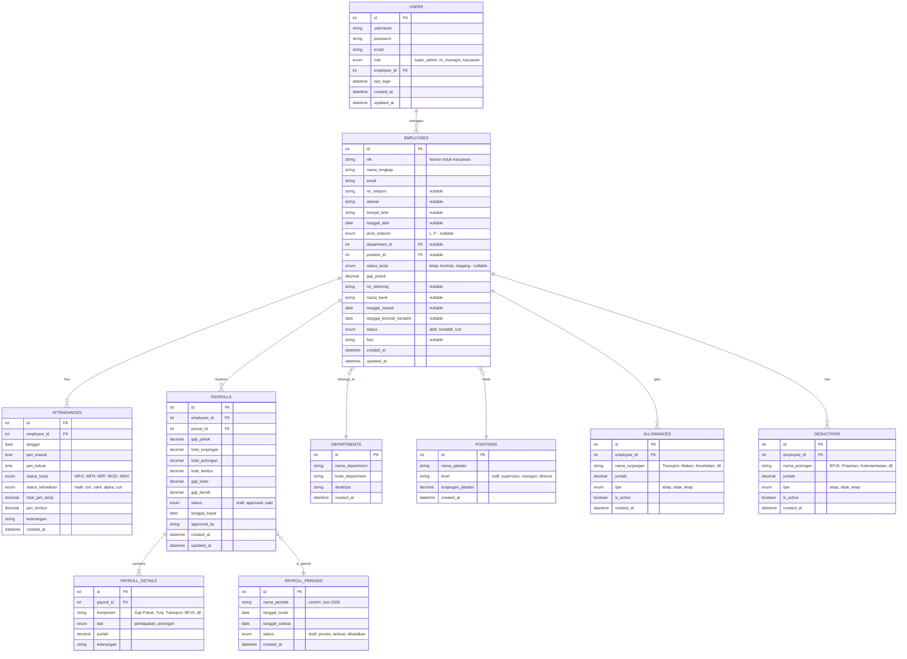

# Entity Relationship Diagram (ERD) - HRDApps

## Diagram ERD

---

## Penjelasan Tabel

### Tabel Utama

| Tabel | Fungsi |
|-------|--------|
| `users` | Menyimpan data login (username, password, role) |
| `employees` | Data lengkap karyawan (identitas, jabatan, gaji pokok, rekening) |
| `departments` | Daftar departemen/divisi perusahaan |
| `positions` | Daftar jabatan beserta tunjangan jabatan |

### Tabel Absensi

| Tabel | Fungsi |
|-------|--------|
| `attendances` | Rekap kehadiran harian (jam masuk, jam keluar, status kerja, lembur) |

### Tabel Penggajian

| Tabel | Fungsi |
|-------|--------|
| `payroll_periods` | Periode penggajian (bulanan) |
| `payrolls` | Header gaji per karyawan per periode |
| `payroll_details` | Detail komponen gaji (rincian pendapatan & potongan) |
| `allowances` | Master tunjangan per karyawan |
| `deductions` | Master potongan per karyawan |

---

## Relasi Antar Tabel

1. **Users - Employees**: 1 user terhubung ke 1 karyawan (login account)
2. **Employees - Departments**: Banyak karyawan dalam 1 departemen
3. **Employees - Positions**: Banyak karyawan bisa punya jabatan yang sama
4. **Employees - Attendances**: 1 karyawan punya banyak data kehadiran
5. **Employees - Payrolls**: 1 karyawan punya banyak data gaji (per periode)
6. **Payrolls - Payroll Details**: 1 slip gaji punya banyak komponen detail
7. **Payrolls - Payroll Periods**: Banyak slip gaji dalam 1 periode
