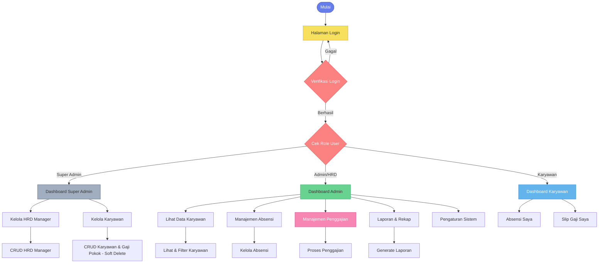
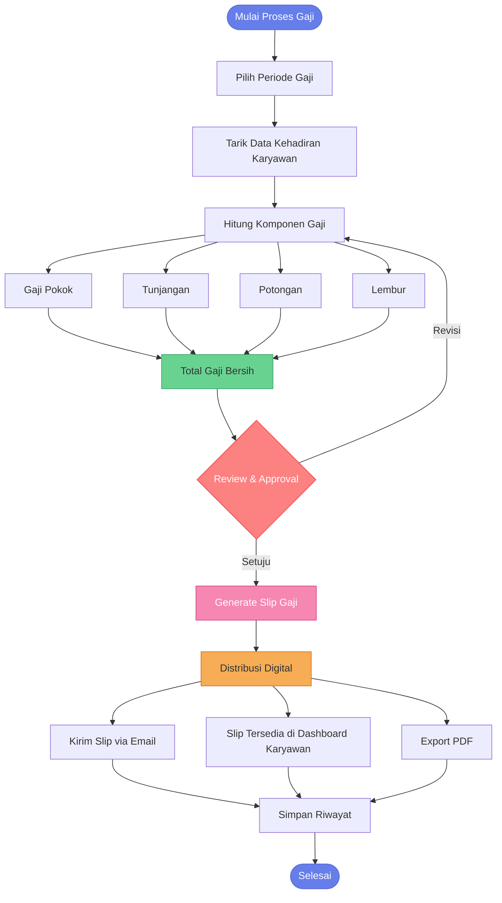
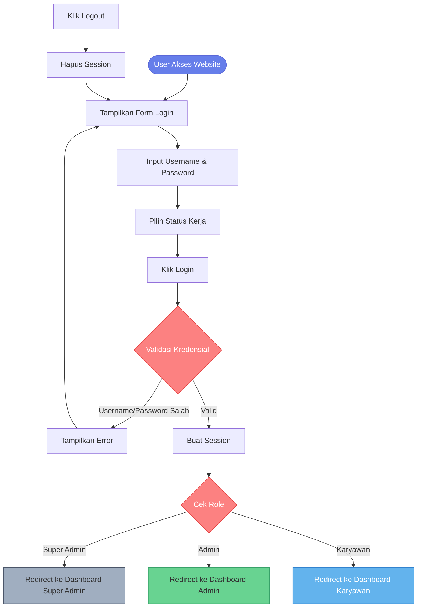
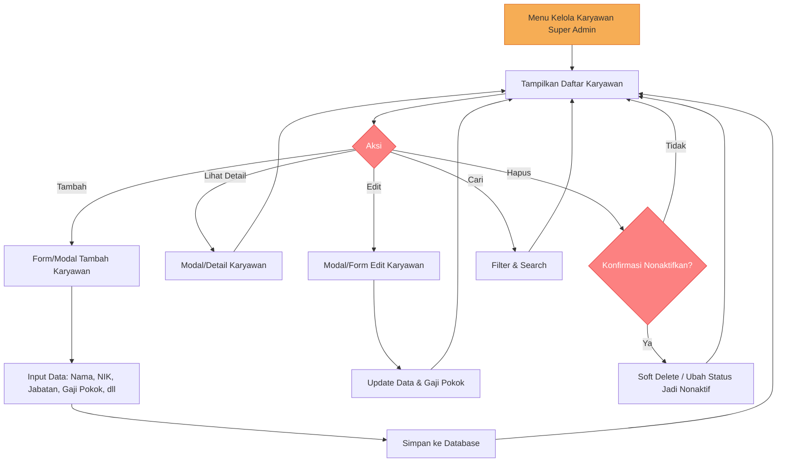
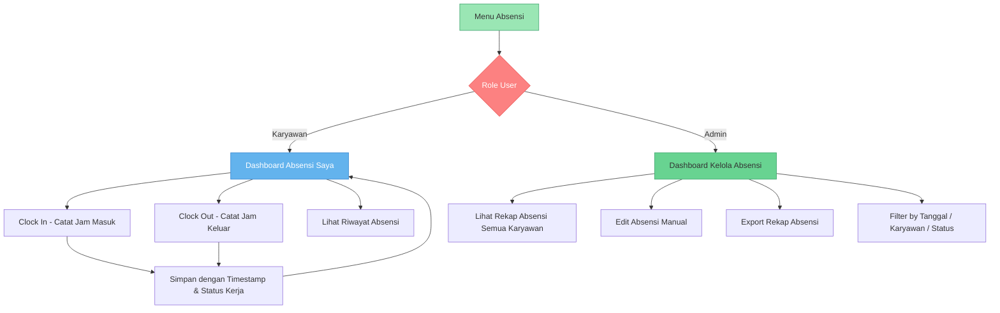

# Flowchart Sistem HRDApps

## 1. Alur Utama Sistem

---

## 2. Alur Penggajian Digital (Fitur Utama)

---

## 3. Alur Login & Autentikasi

---

## 4. Alur CRUD Karyawan (Super Admin)

---

## 5. Alur Absensi

