# Sitemap & Navigasi HRDApps

## Struktur Halaman

```mermaid
graph TD
    ROOT["hrdapps.id"] --> LOGIN["/ Login Page"]
    
    LOGIN --> SUPERADMIN["Super Admin Panel"]
    LOGIN --> ADMIN["Admin/HRD Panel"]
    LOGIN --> KARYAWAN["Karyawan Panel"]
    
    SUPERADMIN --> SAD["/superadmin/dashboard"]
    SUPERADMIN --> SAM["/superadmin/hrd-manager"]
    SUPERADMIN --> SAK["/superadmin/karyawan"]
    
    ADMIN --> AD["/backoffice/dashboard"]
    ADMIN --> AK["/backoffice/karyawan"]
    ADMIN --> AA["/backoffice/absensi"]
    ADMIN --> AP["/backoffice/penggajian"]
    ADMIN --> AL["/backoffice/laporan"]
    ADMIN --> AS["/backoffice/pengaturan"]
    
    AK --> AK1["/karyawan - Lihat & Filter"]
    
    AA --> AA1["/absensi - Rekap"]
    AA --> AA2["/absensi/edit/:id"]
    AA --> AA3["/absensi/export"]
    
    AP --> AP1["/penggajian - Daftar Periode"]
    AP --> AP2["/penggajian/proses/:period_id"]
    AP --> AP3["/penggajian/slip/:id"]
    AP --> AP4["/penggajian/riwayat"]
    
    AL --> AL1["/laporan/absensi"]
    AL --> AL2["/laporan/penggajian"]
    AL --> AL3["/laporan/karyawan"]
    
    KARYAWAN --> KD["/karyawan/dashboard"]
    KARYAWAN --> KG["/karyawan/gaji"]
    
    KD --> KD1["/absensi/clock-in"]
    KD --> KD2["/absensi/clock-out"]
    KD --> KD3["/absensi/kalender-bulanan"]
    
    KG --> KG1["/gaji/slip-terbaru"]
    KG --> KG2["/gaji/download/:id"]

    style ROOT fill:#667eea,color:#fff
    style LOGIN fill:#f6e05e,color:#333
    style SUPERADMIN fill:#a0aec0,color:#333
    style ADMIN fill:#68d391,color:#333
    style KARYAWAN fill:#63b3ed,color:#fff
    style AP fill:#f687b3,color:#fff
```

---

## Daftar Halaman Lengkap

### Panel Super Admin

| No | Halaman | URL | Deskripsi |
|----|---------|-----|-----------|
| 1 | Dashboard | `/superadmin/dashboard` | Overview statistik sistem (total karyawan, total HRD manager), aktivitas log |
| 2 | Kelola HRD Manager | `/superadmin/hrd-manager` | Tabel pengelolaan data login dan status HRD manager (CRUD) |
| 3 | Kelola Karyawan | `/superadmin/karyawan` | Tabel pengelolaan data lengkap karyawan, CRUD Karyawan, dan Setup Gaji Pokok |

### Panel Admin/HRD

| No | Halaman | URL | Deskripsi |
|----|---------|-----|-----------|
| 1 | Dashboard | `/backoffice/dashboard` | Overview statistik karyawan, absensi hari ini, status gaji |
| 2 | Daftar Karyawan | `/backoffice/karyawan` | Tabel semua karyawan dengan search, filter, & ekspor Excel (Tampilan Read-Only, tanpa fungsi CRUD) |
| 3 | Rekap Absensi | `/backoffice/absensi` | Tabel absensi semua karyawan |
| 4 | Daftar Periode Gaji | `/backoffice/penggajian` | List periode penggajian |
| 5 | Proses Gaji | `/backoffice/penggajian/proses/:id` | Halaman hitung & proses gaji per periode |
| 6 | Slip Gaji | `/backoffice/penggajian/slip/:id` | Preview & cetak slip gaji |
| 7 | Riwayat Gaji | `/backoffice/penggajian/riwayat` | Histori semua penggajian |
| 8 | Laporan | `/backoffice/laporan` | Generate & export laporan |
| 9 | Pengaturan | `/backoffice/pengaturan` | Setting sistem & Logout |

### Panel Karyawan

| No | Halaman | URL | Deskripsi |
|----|---------|-----|-----------|
| 1 | Dashboard | `/karyawan/dashboard` | Dashboard Absensi Saya (Clock In/Out, Ringkasan Kehadiran Bulanan, Kalender Kehadiran) |
| 2 | Slip Gaji | `/karyawan/gaji` | Melihat & download slip gaji digital ter-update |
